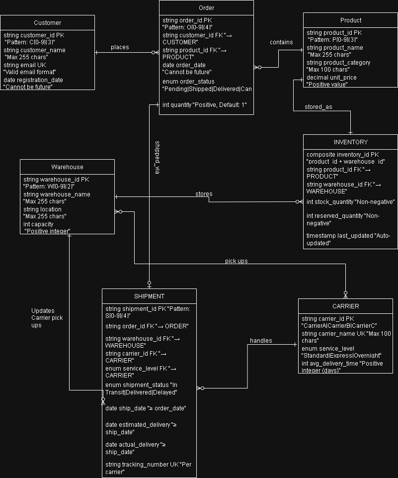

# Palantir Developer Technical Challenge  

## 1. Introduction  

The objective of this ontology design was to integrate siloed data across orders, inventory, warehouses and shipments into a unified data model. By creating standardized relationships, constraints and definitions, this ontology enables interoperability across business systems, supports automation and provides a foundation for advanced analytics such as demand forecasting and supply chain optimization.  

---

## 2. Understanding and Analysing the Data  

Before designing the ontology, an assessment of the available datasets was performed. The analysis highlighted several challenges:  

### Entity Identification  
- Core entities: **Customer, Order, Product, Inventory, Warehouse, Shipment, Carrier**.  

### Disconnects Across Systems  
- Orders not always tied to the specific warehouse.  
- Shipment data misaligned with order status (e.g., orders marked *Delivered* while shipments remained *In Transit*).  
- Inventory data isolated, making reconciliation with demand difficult.  

### Impact of Data Silos  
- Lack of cross-functional analysis (e.g., shipment delays affecting inventory).  

**Ontology Response:** Relationships explicitly link orders, warehouses, inventory, and shipments.  

---

## 3. Assumptions Made  

- **Order Fulfillment:** Each order fulfilled from a warehouse (even if missing in source data).  
- **Shipment Status Hierarchy:** Shipment status = source of truth; order status aligned.  
- **Inventory Tracking:** Inventory is warehouse-specific, tied to product-warehouse.  
- **Date Constraints:**  
  - Order dates cannot be in the future.  
  - Shipment dates ≥ order date.  
  - Estimated/actual delivery ≥ shipment date.  
- **Carrier Service Levels:** Standardized across carriers (Standard, Express, Overnight).  

---

## 4. Design Approach  

### a. Entity-Centric Modeling  
- Core entities with attributes and constraints (e.g., non-negative stock, valid email).  

### b. Relationship Definition  

### c. Business Rules and Constraints  
- Composite keys prevent duplication.  
- Validation rules ensure data quality.  
- Enumerations standardize states (*Pending, Shipped, Delivered*).  

---

## 5. Business Context Considered  

- **Current Goal:** Unify logistics, inventory, and customer data.  
- **Challenges Addressed:** Improve warehouse visibility, reduce delays, standardize shipment/order tracking.  
- **Scalability:** Enables predictive restocking, customer insights, carrier benchmarking.  

---

## 6. Cross-Functional Data Use  

- Shipment delays → inventory forecasting.  
- Customer orders → demand prediction & safety stock planning.  
- Carrier delivery times → SLA compliance tracking.  

---

## 7. Benefits  

- **Interoperability:** Breaks down silos by unifying data.  
- **Automation:** Enables restock alerts, dashboards, and monitoring.  
- **Operational Insights:** Supports predictive analytics and proactive decision-making.  

---

## 8. Conclusion  

The ontology provides a robust foundation for supply chain automation by:  
- Enforcing data quality.  
- Clarifying relationships.  
- Unlocking opportunities for efficiency in **Palantir Foundry**.  

---

# Automation Logic Report  

## 1. Objective  

Trigger restocking recommendations whenever stock levels fall below thresholds, ensuring demand coverage without overstocking.  

---

## 2. Key Data Considered  

- **Sales Velocity (30 days):** Units sold per product-warehouse.  
- **Average Shipment Times:** Delivery duration from warehouse to customer.  
- **Current Inventory Levels:** Available stock (net of reservations).  

---

## 3. Automation Logic  

1. **Calculate Sales Velocity:** Daily sales rate per product-warehouse.  
2. **Determine Safety Stock:**  
   - Safety stock = sales velocity × 14 days.  
3. **Compute Reorder Point:**  
   - Reorder point = sales velocity × (avg shipment time + 7 days).  
   - If available stock ≤ reorder point → restocking flagged.  
4. **Recommended Restock Quantity:**  
   - Target stock = safety stock + (sales velocity × 30 days).  
   - Restock qty = target − available stock.  
5. **Prioritize by Urgency:**  
   - Urgency score = `(reorder point − available stock) ÷ reorder point × 100`.  

---

## 4. Output  

- **Fields:** `product_id`, `warehouse_id`, `recommended_restock_quantity`.  
- **Additional Insights:** urgency score, sales velocity, shipment time.  
- **Formats:** console report, CSV export, JSON for integration.  

---

## 5. Benefits  

- Prevents stockouts with proactive forecasting.  
- Aligns replenishment with shipment lead times.  
- Scalable to new products, warehouses, carriers.  

---

# Business Value Report  

## 1. Business Problem  

- **Order/Shipment Mismatches** → unclear delivery progress.  
- **Inventory Blind Spots** → no traceability per warehouse.  
- **Inefficient Decisions** → manual reconciliation, delays, missed opportunities.  

---

## 2. The Solution  

- Ontology-driven model integrates **Orders, Inventory, Shipments**.  
- Standardized constraints (dates, service levels).  
- Automated inventory restock recommendations.  
- Generates insights:  
  - Avg delivery times per carrier.  
  - Top 5 products last quarter.  
  - Warehouse-level shortage visualization.  
  - Supplier integration for procurement-demand link.  

---

## 3. Business Value Delivered  

### Operational Efficiency  
- Eliminates manual reconciliation.  
- Real-time visibility.  
- Automates repetitive monitoring.  

### Reduced Stockouts & Delays  
- Predictive restocking prevents shortages.  
- Shipment data feeds inventory planning.  
- Shifts from *reactive* to *predictive*.  

### Scalable & Reusable Foundation  
- Supports finance, customer service, analytics.  
- Basis for AI forecasting, supplier optimization.  

### Improved Customer Experience  
- Faster, reliable deliveries.  
- Transparent tracking.  
- Better stock alignment to demand.  

---

## 4. Strategic Impact  

- **Cross-functional insights** (shipment delays → safety stock).  
- **Aligns operations with growth.**  
- **Digital backbone** for automation & analytics.  
